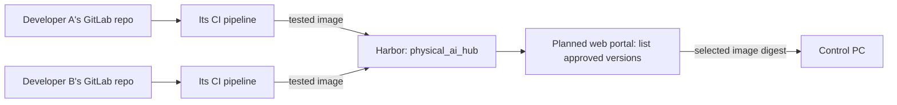

# Shared Harbor images for the team

Use one Harbor project, `physical_ai_hub`, as the catalog for the group's runtime
images. Each application has its own GitLab repository and its own image name
inside that Harbor project. CI builds and tests a new version; developers do
not replace images manually in Harbor.



For example, `cup-picker` publishes to
`harbor.keti.xrds.kr/physical_ai_hub/cup-picker:runtime-<commit SHA>`, while
`grasp-test` publishes to
`harbor.keti.xrds.kr/physical_ai_hub/grasp-test:runtime-<commit SHA>`.
A new build gets a new tag; the portal should record the selected image digest
so a running job uses the exact approved image.

## One-time setup by the group owner

1. In Harbor project `physical_ai_hub`, create a project robot account with
   **Pull Repository** and **Push Repository** permissions. Keep its full
   username and secret out of Git repositories.
2. In the **smallest GitLab group containing the participating repositories**,
   open **Settings > CI/CD > Variables** and add `DOCKER_AUTH_CONFIG` as a
   single-line, masked, protected **Variable**. Turn off variable expansion.
   Its value is Docker authentication JSON:

   ```json
   {"auths":{"harbor.keti.xrds.kr":{"auth":"BASE64_OF_ROBOT_USERNAME_COLON_SECRET"}}}
   ```

   Generate the `auth` value locally with
   `printf '%s:%s' "$ROBOT_USERNAME" "$ROBOT_SECRET" | base64 | tr -d '\n'`.
   Use the full Harbor robot username, including its prefix. Do not paste the
   robot secret into this document or a CI file.
3. Protect each repository's publishing branch (usually `main`). The protected
   variable is available to pipelines on protected refs. Confirm each project
   shows the inherited group variable in its CI/CD settings. If a project has
   its own `DOCKER_AUTH_CONFIG`, remove that copy after confirming inheritance:
   project variables take precedence over group variables.

## For each developer repository

1. Give its CI pipeline a unique, fixed Harbor image name. The example pipeline
   in this repository uses `fr3-wave-runtime`; another repository must replace
   that name with its own in the build, smoke-test, and publish jobs.
2. Run package and simulation tests, build the runtime image, smoke-test that
   image, then publish `runtime-<commit SHA>` from the protected branch. Only
   tested versions should appear as runnable choices in the portal.
3. Tell the portal which image version and digest is approved. The portal and
   Control PC need **pull** access to this private Harbor project; they do not
   need the CI robot's push credential.

One robot account can serve all ten CI pipelines concurrently. Harbor grants
its push permission across the **whole Harbor project**, not one image name.
Use reviewed CI changes and unique image names for this trusted group. A GitLab
runner storage/PVC failure still has to be fixed separately; Harbor cannot
provide the runner's temporary build volume.

See [Harbor project robot accounts](https://goharbor.io/docs/main/working-with-projects/project-configuration/create-robot-accounts/)
and [GitLab CI/CD variable inheritance and precedence](https://docs.gitlab.com/ci/variables/).
